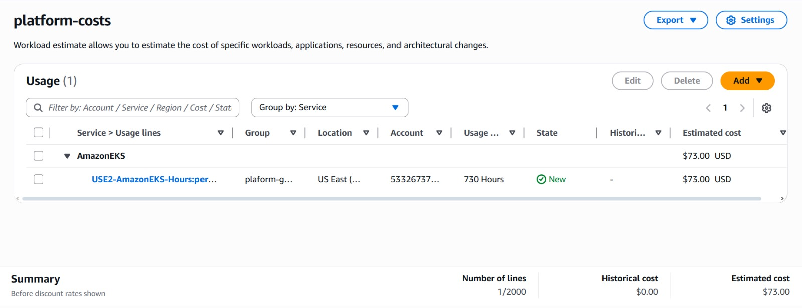

# Análise de Custos

## Introdução

Para estimar os custos de execução da nossa infraestrutura em produção, utilizamos a ferramenta **[AWS Pricing Calculator](https://calculator.aws.amazon.com/)**. Embora nossa análise seja hipotética, ela reflete uma configuração realista baseada nos recursos utilizados ao longo do projeto.

## Estimativa Gerada

Estimando que nossa aplicação teria um tamanho de baixo a médio porte, fizemos uma simulação que resultou em uma estimativa de custos:

> A imagem acima mostra os valores simulados para os serviços mencionados, totalizando um custo mensal compatível com um ambiente acadêmico de pequeno porte.

## Conclusão

A análise de custos hipotética nos ajudou a compreender como decisões de arquitetura influenciam diretamente no orçamento do projeto. Além disso, reforça a importância de monitorar e otimizar continuamente os recursos em nuvem para evitar gastos desnecessários.

---

*Autores: Gustavo Colombi Ribolla e Rafaela Afférri de Oliveira*