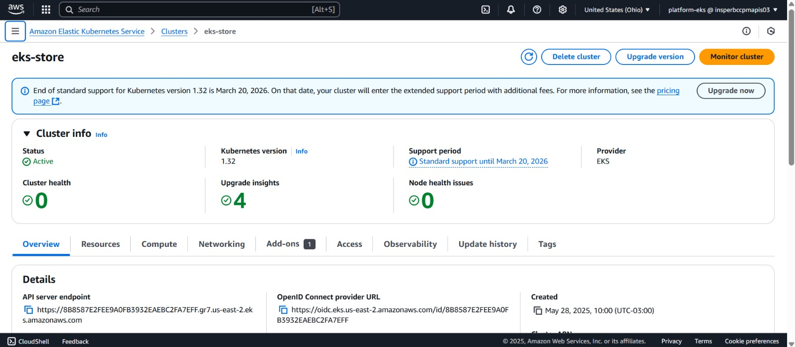

# AWS

## Visão Geral

A AWS (Amazon Web Services) foi utilizada como a principal provedora de nuvem para hospedar a infraestrutura do projeto. A escolha se deu devido à sua ampla adoção no mercado, escalabilidade e integração com serviços gerenciados como o EKS.

## Serviços Utilizados

Durante o desenvolvimento e entrega do projeto, os seguintes serviços da AWS foram empregados:

- **EC2 (Elastic Compute Cloud):** utilizado pontualmente para testes locais e suporte à infraestrutura.
- **IAM (Identity and Access Management):** gerenciamento de permissões e acessos seguros aos recursos da nuvem.
- **VPC (Virtual Private Cloud):** rede privada configurada para isolar os recursos do projeto.
- **EKS (Elastic Kubernetes Service):** serviço gerenciado de Kubernetes utilizado para orquestração dos microsserviços da aplicação.



## API em produção

A aplicação foi exposta publicamente por meio de um Load Balancer gerado automaticamente pelo serviço EKS.

O endpoint da API em execução é:

```
http://abcad5ad7b3a448dea1af26b7b679e7f-1432887122.us-east-2.elb.amazonaws.com:8080
```

Esse endpoint retorna informações sobre o microsserviço e valida a disponibilidade do sistema implantado na nuvem.

## Conclusão

A AWS proporcionou uma base robusta e segura para o deploy da aplicação, com ferramentas que permitiram desde a criação do cluster Kubernetes até a exposição da aplicação via Load Balancer com alta disponibilidade.

---

*Autores: Gustavo Colombi Ribolla e Rafaela Afférri de Oliveira*