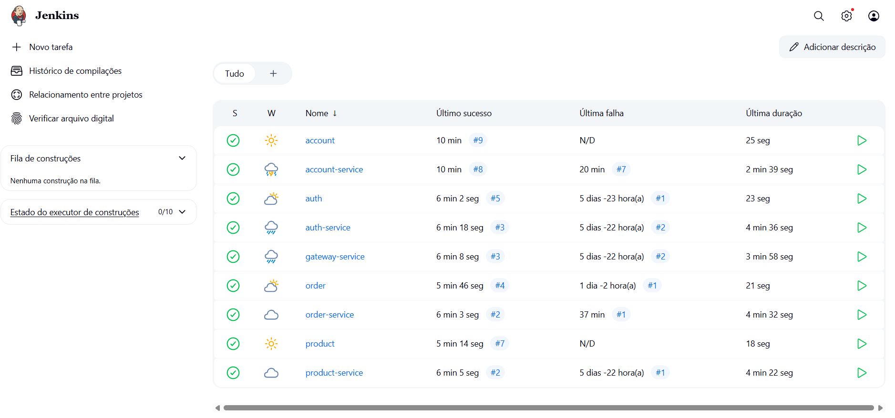

# CI/CD

A entrega contínua da aplicação foi automatizada utilizando o Jenkins, uma das ferramentas de integração contínua mais consolidadas do mercado.

## Jenkins

O Jenkins é uma plataforma de automação open-source amplamente utilizada para CI/CD. Ele permite a orquestração de pipelines que automatizam desde os testes até o deploy em produção.



## Jenkinsfile – Interfaces

As interfaces (como `product`, `order`, `account`) utilizam um Jenkinsfile simples para build Maven:

```groovy
pipeline {
    agent any

    stages {
        stage('Build') {
            steps {
                sh 'mvn -B -DskipTests clean install'
            }
        }
    }
}
```

Este pipeline **compila o código** e garante que as dependências estejam corretas, mas não realiza deploy de imagens.

---

## Jenkinsfile – Services

Para os services (como `order-service`, `product-service`, etc.), o Jenkinsfile realiza também o build da imagem Docker e seu push para o Docker Hub:

```groovy
pipeline {
    agent any
    environment {
        SERVICE = 'order-service'
        NAME = "rafaelaafferri/${env.SERVICE}"
    }
    stages {
        stage('Dependecies') {
            steps {
                build job: 'order', wait: true
                build job: 'product', wait: true
            }
        }
        stage('Build') { 
            steps {
                sh 'mvn -B -DskipTests clean package'
            }
        }      
        stage('Build & Push Image') {
            steps {
                withCredentials([usernamePassword(credentialsId: 'dockerhub-credential', usernameVariable: 'USERNAME', passwordVariable: 'TOKEN')]) {
                    sh "docker login -u $USERNAME -p $TOKEN"
                    sh "docker buildx create --use --platform=linux/arm64,linux/amd64 --node multi-platform-builder-${env.SERVICE} --name multi-platform-builder-${env.SERVICE}"
                    sh "docker buildx build --platform=linux/arm64,linux/amd64 --push --tag ${env.NAME}:latest --tag ${env.NAME}:${env.BUILD_ID} -f Dockerfile ."
                    sh "docker buildx rm --force multi-platform-builder-${env.SERVICE}"
                }
            }
        }
    }
}
```

## Pipeline de Deploy

Na nossa solução, o Jenkins foi configurado para realizar o `kubectl apply` dos manifests diretamente no cluster gerenciado pela AWS através do EKS.

### Etapas principais do pipeline:

1. **Checkout do repositório** com os manifests e a aplicação.
2. **Build da imagem** da aplicação e push para o repositório.
3. **Deploy automatizado** via `kubectl apply -f` dos arquivos YAML na AWS.

Esse processo garante que qualquer mudança realizada no código seja rapidamente propagada para o ambiente em nuvem, assegurando confiabilidade e agilidade no ciclo de vida da aplicação.

---

*Autores: Gustavo Colombi Ribolla e Rafaela Afférri de Oliveira*