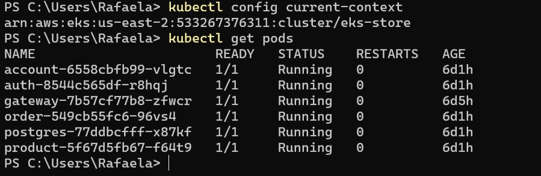

# EKS (Elastic Kubernetes Service)

## Visão Geral

Utilizamos o **Amazon EKS** como nossa plataforma de orquestração de containers. Esse serviço permite executar aplicações em contêineres usando Kubernetes gerenciado, o que facilita o deploy e a escalabilidade de microsserviços.

## Deploy via Jenkins

O processo de deploy foi automatizado através do **Jenkins**, que aplicava os manifests (`.yaml`) de cada microsserviço diretamente no cluster EKS. Cada serviço possuía seus próprios arquivos de configuração, garantindo modularidade e organização.

## Gateway e Load Balancer

O gateway da aplicação foi exposto ao público por meio de um **Load Balancer** gerado automaticamente pelo EKS. Esse Load Balancer atua como ponto de entrada para as requisições externas, encaminhando-as corretamente para os serviços no cluster.

---

*Autores: Gustavo Colombi Ribolla e Rafaela Afférri de Oliveira*