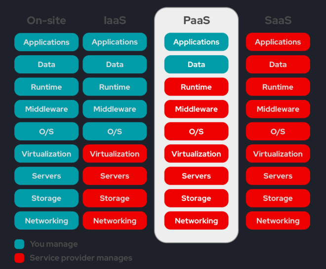

# Uso de PaaS no Projeto

## O que é PaaS?

PaaS (Plataforma como Serviço) é um modelo de computação em nuvem que fornece um ambiente gerenciado para desenvolver, testar e executar aplicações, abstraindo a infraestrutura subjacente. Com PaaS, a equipe de desenvolvimento pode focar no código e na lógica da aplicação, enquanto a plataforma cuida de aspectos como provisionamento de recursos, escalabilidade e atualização de ambiente.

## Onde Utilizamos PaaS no Projeto

### 1. Amazon EKS (Elastic Kubernetes Service)
Utilizamos o Amazon EKS para orquestrar os containers dos nossos microserviços. Ele é um exemplo de PaaS voltado para orquestração de contêineres, pois:

- A AWS gerencia automaticamente os nós de controle do Kubernetes.
- Oferece integração facilitada com serviços como IAM, VPC, Load Balancer e auto scaling.
- Permite executar, escalar e monitorar os serviços com mínima configuração de infraestrutura.

### 2. Jenkins (Pipeline CI/CD como serviço)
O Jenkins foi utilizado para automação do processo de integração contínua e entrega contínua (CI/CD). Ele pode ser considerado uma ferramenta PaaS self-managed ou hospedada, dependendo do ambiente:

- Automatiza o build, testes e deploy da aplicação em cada push de código.
- Pode ser integrado ao EKS para realizar deploy direto nos pods.
- Reduz o esforço manual de atualizações e versionamento.

### 3. PostgreSQL com Docker
Mesmo utilizando PostgreSQL em containers, ele pode ser considerado parte de uma arquitetura tipo PaaS:

- A persistência e configuração do banco são automatizadas via Docker e Kubernetes.
- Em ambientes reais, seria comum utilizar um serviço gerenciado como RDS (AWS) ou ElephantSQL.

## Benefícios do Uso de PaaS

- **Abstração da infraestrutura complexa (especialmente via EKS)**.
- **Automação de processos repetitivos com Jenkins**, garantindo entregas contínuas.
- **Escalabilidade e monitoramento nativos no EKS**.
- **Foco no desenvolvimento e não na infraestrutura**.
