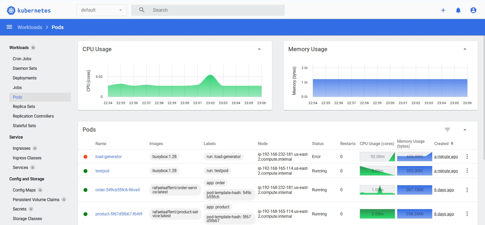

# Teste de Carga com HPA

Neste experimento, realizamos um **teste de carga** na aplicação `gateway` do sistema, com o objetivo de observar o comportamento do **HPA (Horizontal Pod Autoscaler)** em um cluster Kubernetes.

## Objetivo

Avaliar a escalabilidade automática de pods do microserviço `gateway` em resposta ao aumento de uso de CPU provocado por múltiplas requisições simultâneas.

---

## Configuração do Dashboard

Para visualização gráfica dos recursos do cluster e do comportamento do HPA, utilizamos o **Kubernetes Dashboard**. A instalação foi feita com os comandos:

```bash
kubectl apply -f https://raw.githubusercontent.com/kubernetes/dashboard/v2.7.0/aio/deploy/recommended.yaml
kubectl proxy
```

O acesso foi feito via browser em:

```
http://localhost:8001/api/v1/namespaces/kubernetes-dashboard/services/https:kubernetes-dashboard:/proxy/
```

---

## Comandos Utilizados

### Criação do HPA

```bash
kubectl autoscale deployment gateway --cpu-percent=50 --min=1 --max=10
```

Esse comando cria um autoscaler horizontal baseado em uso de CPU, com um limite mínimo de 1 pod e máximo de 10 pods.

### Execução do teste de carga

```bash
kubectl run -i --tty load-generator --rm --image=busybox:1.28 --restart=Never -- /bin/sh -c "while sleep 0.01; do wget -qO- http://gateway:8080/info; done"
```

Esse comando cria um pod temporário que envia requisições constantes para o endpoint `/info` do microserviço `gateway`.

## Resultado

Durante o teste, o número de réplicas do `gateway` aumentou progressivamente conforme a CPU média ultrapassava o limite de 50%. Isso confirma que o HPA está corretamente configurado e reagindo às condições de carga.

Abaixo está um print do dashboard do Kubernetes mostrando o estado do HPA durante o teste:



---

## Ferramentas Utilizadas

- Kubernetes Dashboard: [https://kubernetes.io/docs/tasks/access-application-cluster/web-ui-dashboard/](https://kubernetes.io/docs/tasks/access-application-cluster/web-ui-dashboard/)
- Documentação HPA: [https://kubernetes.io/docs/tasks/run-application/horizontal-pod-autoscale/](https://kubernetes.io/docs/tasks/run-application/horizontal-pod-autoscale/)

---

## Conclusão

O teste demonstrou que o autoscaling horizontal funciona conforme o esperado e responde rapidamente a picos de carga. O Kubernetes Dashboard foi essencial para visualizar em tempo real o comportamento dos pods e do HPA.
